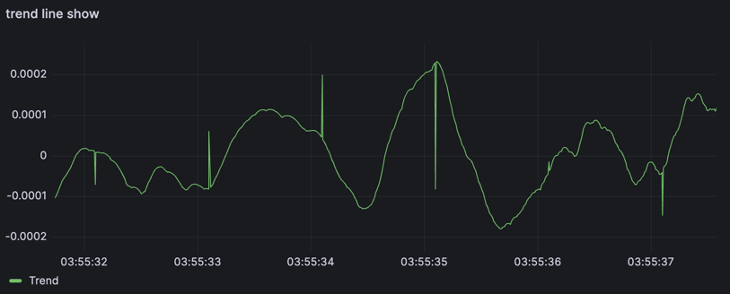
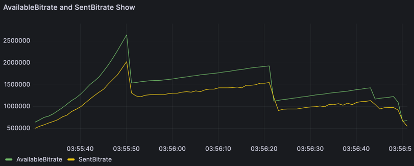

# Bifrost

Bifrost is an experimental system that integrates multiple Qos methods, and can conduct point-to-point/multi-point weak 
network confrontation experiments. For the convenience of operation, we have simplified the difficulty of parameter 
adjustment and provided detailed information for each link. This project will include common bandwidth estimation 
algorithms, compensation methods such as FEC, Nack, and Red in WebRTC, and provide more room for expansion for basic 
multi-stream competition experiments.

## Install

***Just support MacOS/Linux now!***

***Clion idea is recommended.***

### 1.Clone code
```
git clone https://github.com/qw225967/Bifrost.git
```

### 2.Libuv static library build
Need add the libuv.a to CMakeLists.txt — target_link_libraries(worker libuv.a)

```
cd Bifrost/worker/third_party/libuv/

mkdir -p build

# generate project with tests
cd build && cmake .. -DBUILD_TESTING=ON

# add `-j <n>` with cmake >= 3.12
cmake --build build
```

### 3.Debug
Clion must use lldb. 

## Display

This demo uses grafana-based data display, using the CSV file path as the data source.

### 1.Mac uses grafana

Mac install grafana

```
brew update

brew install grafana
```

grafana service operate

```
# start grafana service
brew services start grafana

# stop grafana service
brew services stop grafana

# restart grafana service
brew services restart grafana
```

Add this option to **grafana/grafana.ini**
Use ***ps -ef | grep grafana*** command to view the default startup configuration

```
[plugin.marcusolsson-csv-datasource]
allow_local_mode = true
```

### 2.Show
The figure below shows the trend of the slope in the trend line module of the GCC algorithm during the transmission 
process.


The figure below shows the target code rate and sending code rate of the GCC algorithm during transmission.
