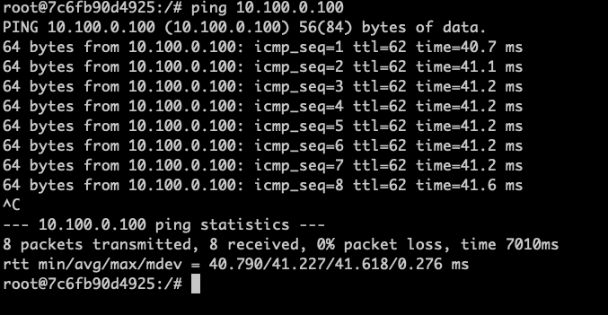

# Bifrost NS3 Interface

This part provides an ability to support the ns3 simulation program to connect to the physical network. We can develop customized topology based on the topology interface.

## Proxy Architecture

We proxy physical network transmission based on docker and nginx. Input the data that needs to be transmitted into the ns3 network of docker through nginx and then output it back to the physical network.

```
/* 
 *
 * docker container
 * client: Support client connection
 * server: Support server connection
 * bifrost-ns3: ns3 simulation
 *
 */
                                          +---------------------+
                                            |                     |
            +---------------------+         |                     |         +---------------------+
            |        docker       |         |                     |         |         docker      |
            |               +-----+-----+   |                     |   +-----+-----+               |        
+---------------+    client |           |   |       Bifrost       |   |           | server    +---------------+    
|   virtually   |           |           |   |                     |   |           |           |   virtually   |    
+               +           +   nginx   +---+         NS-3        +---+  nginx    +           +               +
|   10.0.0.2    |           |           |   |                     |   |           |           |   10.100.0.2  |
+---------------+           |           |   |      Simulation     |   |           |           +---------------+    
        |   |               +-----+-----+   |                     |   +-----+-----+               |
        |   |      10.0.0.100     |         |                     |         |     10.100.0.100    |
        |   +---------------------+         |                     |         +---------------------+    
        |                                   |                     |
        |                                   +---------------------+
        |
        |
+-------+-------+
|               |
+    bifrost    +
+     proxy     +
|               |
+---------------+
     |   |
    in  out
```

## Usage

Run the **ns3-interface/setup.sh** script, which will create three docker containers.

```
sh setup.sh
```
This process takes a long time for the first time.

You can run the following command to enter the container:

```
docker exec -it bifrost-ns3 /bin/bash
docker exec -it client /bin/bash
docker exec -it server /bin/bash
```


### Example
You can use the **ping** command to test end-to-end connectivity in two port containers:

client ip is **10.0.0.100**, server ip is **10.100.0.100**.

login client docker
```
docker exec -it client /bin/bash

ping 10.100.0.100
```
The default P2P topology network is set with a delay of 20ms，so the RTT is near 40ms：

